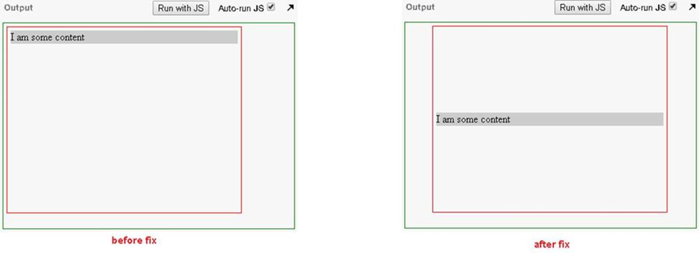

# Frontend-Training-Tasks-Part-1

### This repository describes a Starting point of Front-end Training Tasks in X Company, and this is just part 1 of it and I will follow it with another repositories you will find in my Profile.
## To Run this part and see the results follow link :  

## Task #1:

Align the red container horizontally in the middle of the green container.  
Align the content div vertically in the middle of the red container, the content should be always in the middle no matter how the div height will be or the content itself will be. 
Please deliver two solutions one using CSS2 and the second using CSS3. 
See the image below for what the result is now and what it should be after your CSS solution: 

